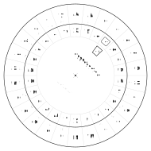

# 🔐 ciphers

Design a **decoder ring** in the browser, play with it — drag the top disc to
set the shift — then print it as a **2-page PDF**, cut out the discs, pin them
together, and en/decode for real.

**Live: [ciphers.jpillora.com](https://ciphers.jpillora.com)**

<p align="center"></p>

## Features

- **Custom alphabet** (default A–Z) — any set of symbols, deduped, emoji work
  on-screen (the PDF's built-in fonts are Latin-1 only)
- **Custom title** (default “Decoder Ring”) — printed on both pages and the
  small disc's face
- **Simulator** — the assembled wheel with a draggable, snap-to-sector top disc
- **Shift window** — a slot in the top disc reveals the rotation count printed
  on the disc beneath: 13 rotations shows **13** (ROT13)
- **Shareable** — title/alphabet/shift live in the URL hash
- Pure frontend, no build step: ES modules + an import map;
  [pdf-lib](https://pdf-lib.js.org) loads lazily from a CDN only when you
  download

## How the wheel works

Two discs pinned through the centre. The large disc carries the alphabet (and
1..n positions) in the outer annulus, plus a hidden ring of shift numbers. The
small disc carries the same alphabet at its rim, a pointer box around its
first glyph, and the cut-out window on the pointer's spoke — rotate it *k*
steps and the window lands exactly on the number *k*.

To **encode**, find each letter on the small disc and write down the
large-disc letter beside it; **decode** is the reverse.

## Print & build

1. Print both PDF pages at **100% scale** (no “fit to page”).
2. Cut out both discs along the solid circles, plus the small window slot.
3. Stack the small disc on the large one; push a split pin through both centre marks.
4. Rotate to set the key — the window shows the shift number.

## Dev

```bash
bun install    # pdf-lib, for the tests only
bun test       # geometry invariants + PDF generation
bun run serve  # http://localhost:8043 (any static server works)
bun run preview  # regenerate docs/preview.svg
```

Deploys as a static site (GitHub Pages once public; a Cloudflare Worker
serving `[assets]` meanwhile). Part of the [jpillora.com](https://jpillora.com)
family of sites.

## License

MIT © Jaime Pillora
